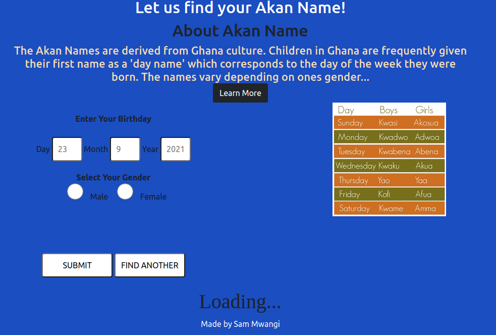

# AKAN Name Day of Birth
A web application that takes users birthday and calculates the day of the week they were born depending on gender outputs their Akan Name. Akan names are derived from Ghanian culture.




## Built With

- HTML
- CSS
- Javascript

## Features


Web application allows user to:

1. Read an overview & origin of the Akan Names.
2. Enter their date, month and year of birth.
3. Select their gender from the radio buttons options.
4. Click submit button to allow the application to load their Akan.
5. View their Akan Name and congratulatory message.
6. Click on find again button and enter other details to view akan names.


## Behaviour Driven Development (BDD)
|Behaviour 	           |    Input 	                 |       Output          |
|----------------------------------------------|:-----------------------------------:|-----------------------------:|       
|Page loads and  a form displayed                         |   User enters form details  and selects from the select radios   and clicks submit                   |Their Akan name is displayed     |                       |


## Getting Started

### Prerequisites

To get this project up and running locally, you must already have npm and nodejs plus the necessary packages installed on your computer

**simple steps set up on your local machine**

```
- $ git clone https://github.com/Sam-Mwangi/AkanName-DOB
- $ git checkout main
- $ cd AkanName-DOB
```

- [Live Version](https://sam-mwangi.github.io/AkanName-DOB/)

## Author

👤 **Sam Mwangi**

## 🤝 Contributing

Contributions, issues and feature requests are always welcome!

I love meeting other developers, especially ones that give me advice on how to improve my work.

Feel free to check the [issues page](https://github.com/Sam-Mwangi/AkanName-DOB).

### How to Contribute

To get a local copy up and running follow these simple example steps.

```
- Fork the repository
- $ git clone https://github.com/your_username/AkanName-DOB
- $ git checkout develop
- $ git checkout -b branch name
- $ git remote add upstream https://github.com/Sam-Mwangi/AkanName-DOB
- $ git pull upstream develop
- $ git commit -m "commit message"
- $ git push -u origin HEAD
```

## Show your support

Finally, if you've read this far, don't forget to give this repo a ⭐️. They're free . . . I think.

## Acknowledgments

- [Moringa School](https://moringaschool.com/) for project specifications.

* LICENSED UNDER  [](license/MIT)
